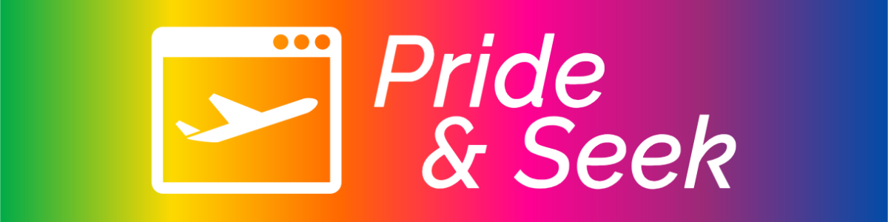

# 🏳️‍🌈🏳️‍🌈🏳️‍🌈 Proud Coders: July 2024 Hackathon 🏳️‍🌈🏳️‍🌈🏳️‍🌈

Add screenshot of live site here...

## Index

1. [Intro](#intro)
2. [Deployment](#deployment)
3. [User Stories](#user-stories)
4. [Criteria](#criteria)
5. [Goal](#goal)
6. [Tech Used](#tech-used)
7. [Credits](#credits)
8. [Acknowledgements](#acknowledgements)

## Intro

The purpose of this website is to provide an interactive way for members of the LGBTQIA+ community to discover holiday destinations that are safe and supportive of their lifestyle, in countries that celebrate diversity.

## Deployment

#### _(please note, your team must also include the deployed links in the usual submission in Hackapp)_

The project is deployed and can be accessed at [http://your-deployed-link.com](http://your-deployed-link.com).

## User Stories

- New visitor

  - What is the website about?
  - Where can I find information on LGBTQIA+ friendly holiday destinations?
  - Which countries are supportive of LGBTQIA+ travellers?
  - Which countries should I avoid travelling to as an LGBTQIA+ traveller?
  - How do I book a holiday through the site?
  - Can I create an account on the site?

- Returning visitor

  - How do I access the account I created previously?
  - Can I save countries as favourites?
  - Who else is travelling to the same country as me?

- Frequent visitor
  - Where can I find a travel buddy?
  - Where can I find more in depth information about a country I am visiting?

## Criteria

In this section, we will briefly discuss how our team addressed the applicable criteria:

- 🏳️‍🌈 The project demonstrates an impact on the LGBTQIA+ community

  - The site is specifically designed to enable members of the LGBTQIA+ community to find destinations that are safe and inclusive, enable them to book holidays, and post blogs about there trips (upon signing up for a user account).

- 🏳️‍🌈 The project is realistic and has real world value

  - It enables people to book holidays safe in the knowledge that they are visiting a LGBTQIA+ friendly country.

- 🏳️‍🌈 The project has excellent design and layout

  - The site features consistent navigation and design (such as colour scheme) across all pages.

- 🏳️‍🌈 The project is presented to the judges in a professional manner

  - The project will be presented to the judges by members of the team.

- 🏳️‍🌈 The project demonstrates innovation and creativity

  - The main feature of the site is an interactive map that users can click to discover countries that are safe to visit, and those to avoid.

## Goal

The goal section provides a concise summary of the main objective or purpose of the project or software described in this README. It addresses the following aspects:

- Problem Statement

  - It is illegal in over 70 countries around the world to identify as a member of the LGBTQIA+ community, and there is therefore a need for a travel site(s) to serve the LGBTQIA+ community with tailored suggestions on where to visit and where to avoid.

- Objective(s)

  - Create a site that allows users to find safe destinations, book holidays to those destinations, and share their experiences afterwards.

- Target Audience

  - LGBTQIA community and their allies.
  - Anyone who is concerned about visiting non-inclusive countries that do not support diversity.

- Benefits

  - Allow users to feel assured that they can travel in safety.

## Tech Used

- [HTML](https://en.wikipedia.org/wiki/HTML), [CSS](https://en.wikipedia.org/wiki/CSS), [JavaScript](https://en.wikipedia.org/wiki/JavaScript), and [Bootstrap.](<https://en.wikipedia.org/wiki/Bootstrap_(front-end_framework)>)
- [GitHub](https://github.com/) for version control.
- [GitHub Pages](https://pages.github.com/) for hosting the website.
- [Heroku](https://www.heroku.com/) for deployment via GitHub Pages.
- [Gitpod](https://gitpod.io/) for online IDE work.
- [Markdown](https://en.wikipedia.org/wiki/Markdown) for the README.md.
- [Figma](https://www.figma.com/) for wireframes.
- [Sarah Renae Clarke's Colour Catalogue V2](https://sarahrenaeclark.com/color-palettes/) for the website colour scheme.
- [Google Fonts](https://fonts.google.com/) for the Raleway font.
- [FontAwesome](https://fontawesome.com/) for logos.

## Credits

Blog post images sourced from [Deposit Photos](https://depositphotos.com/):

- [Rainbow World Map](https://depositphotos.com/vector/map-silhouette-of-the-continents-of-earth-painted-in-colors-of-the-rainbow-lgbt-flag-203681954.html) taken by koksikoks.
- [Copenhagen Illustrative Skyline](https://depositphotos.com/vector/copenhagen-skyline-with-color-landmarks-and-blue-sky-157290390.html) taken by booblgum.
- [Beach Hammock](https://depositphotos.com/photo/beach-hammock-2531939.html) taken by endhals.

## Acknowledgements

- Thanks to Code Institute for the chance to work on this hackathon.
- Thanks to all team members, for their work and co-operation:
  - Sarah Ankers.
  - James (Rob) Cutmore.
  - Dominic Francis.
  - Anthony Griffiths.
  - Oliver Sharp. 
  - Henna Singh.
