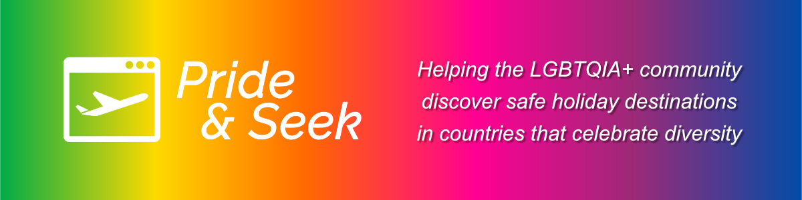

# 🏳️‍🌈🏳️‍🌈🏳️‍🌈 Proud Coders: July 2024 Hackathon 🏳️‍🌈🏳️‍🌈🏳️‍🌈

# 🏳️‍🌈 Pride & Seek 🏳️‍🌈

Add screenshot of live site here...

## Index

1. [Intro](#intro)
2. [Deployment](#deployment)
3. [User Stories](#user-stories)
4. [Criteria](#criteria)
5. [Goal](#goal)
6. [Tech Used](#tech-used)
7. [Credits](#credits)
8. [Acknowledgements](#acknowledgements)

## Intro

The purpose of this website is to provide an interactive way for members of the LGBTQIA+ community to discover holiday destinations that are safe and supportive of their lifestyle, in countries that celebrate diversity.

## Deployment

#### _(please note, your team must also include the deployed links in the usual submission in Hackapp)_

The project is deployed and can be accessed at [http://your-deployed-link.com](http://your-deployed-link.com).

## User Stories

- New visitor
  - What is the website about?
  - Where can I find information on LGBTQIA+ friendly holiday destinations?
  - Which countries are supportive of LGBTQIA+ travellers?
  - Which countries should I avoid travelling to as an LGBTQIA+ traveller?
  - How do I book a holiday through the site?
  - Can I create an account on the site?

- Returning visitor
  - How do I access the account I created previously?
  - Can I save countries as favourites?
  - Who else is travelling to the same country as me?

- Frequent visitor
  - Where can I find a travel buddy?
  - Where can I find more in depth information about a country I am visiting?

## Criteria

In this section, we will briefly discuss how our team addressed the applicable criteria:

- 🏳️‍🌈 The project demonstrates an impact on the LGBTQIA+ community
  
  - Add text here
    
- 🏳️‍🌈 The project is realistic and has real world value
  
   - Add text here
     
- 🏳️‍🌈 The project has excellent design and layout
  
  - Add text here
    
- 🏳️‍🌈 The project is presented to the judges in a professional manner
  
  - Add text here
    
- 🏳️‍🌈 The project demonstrates innovation and creativity
  
  - Add text here
    
## Goal

The goal section provides a concise summary of the main objective or purpose of the project or software described in this README. It addresses the following aspects:

- Problem Statement

  - Add text here
  
- Objective(s)

  - Add text here
  
- Target Audience

  - Add text here
  
- Benefits

  - Add text here

## Tech Used

- [HTML](https://en.wikipedia.org/wiki/HTML), [CSS](https://en.wikipedia.org/wiki/CSS), [JavaScript](https://en.wikipedia.org/wiki/JavaScript), and [Bootstrap.](https://en.wikipedia.org/wiki/Bootstrap_(front-end_framework))
- [GitHub](https://github.com/) for version control.
- [GitHub Pages](https://pages.github.com/) for hosting the website.
- [Gitpod](https://gitpod.io/) for online IDE work.
- [Markdown](https://en.wikipedia.org/wiki/Markdown) for the README.md.
- [Figma](https://www.figma.com/) for wireframes.
- [Sarah Renae Clarke's Colour Catalogue V2](https://sarahrenaeclark.com/color-palettes/) for the website colour scheme.
- [Google Fonts](https://fonts.google.com/) for the Raleway font.
- [FontAwesome](https://fontawesome.com/) for logos.

## Credits

Add credits here ...

## Acknowledgements

Add acknowledgements here ...
